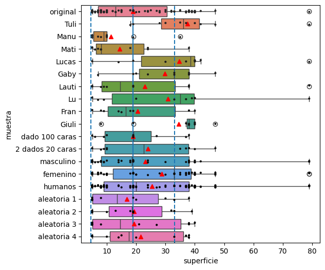
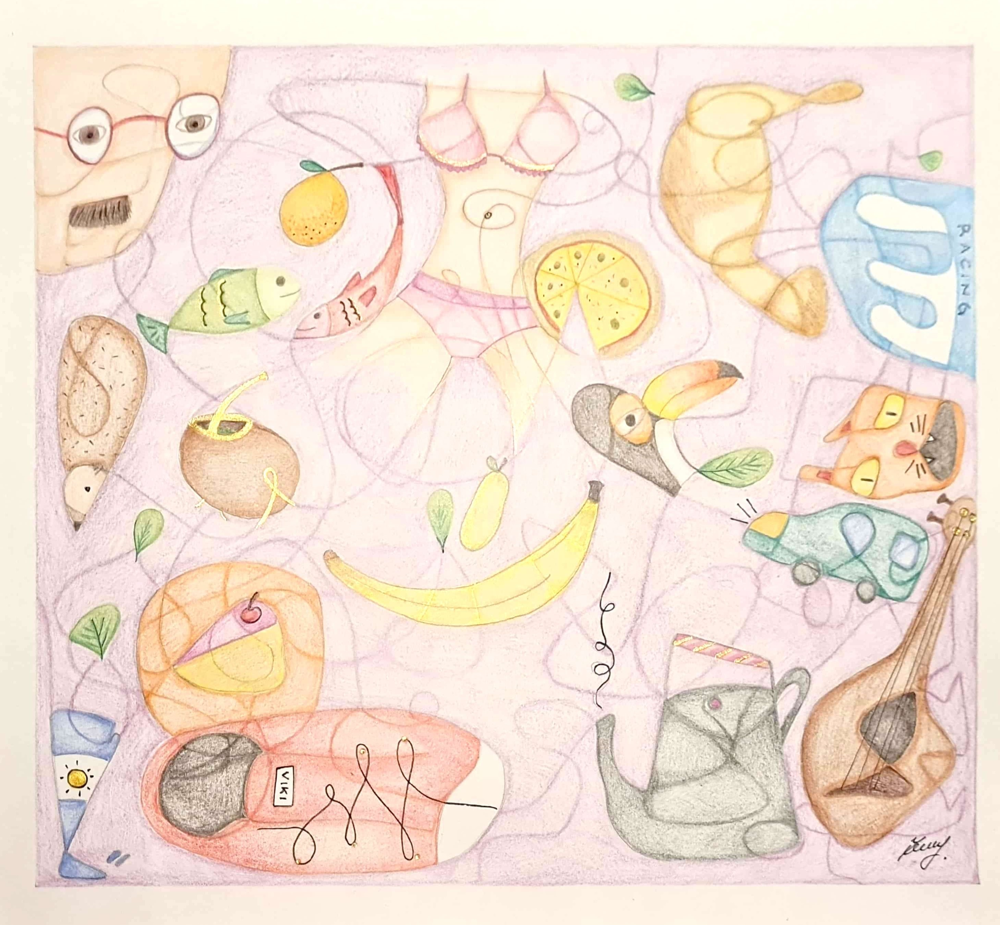
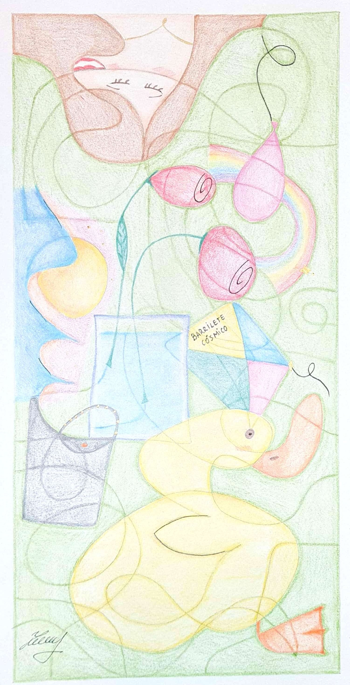

# ideas-estocasticas

Repositorio inspirado en el taller **“Ideas estocásticas fundamentales que conectan el análisis exploratorio y la inferencia informal”**, dictado por la Dra. Liliana Tauber, la Mgtr. Silvana Santellán y la Mgtr. Yanina Redondo, en la II Jornada de Enseñanza de la Estadística.

La simulación completa se encuentra en [esta notebook](notebook.ipynb).

## Descripción

A partir de esa consigna, construí una población artificial de estrellas (ver la [población](images/cielo_estrellado.png)) y le pedí a algunos amigos que eligieran, también "al azar", una muestra de 10 estrellas que resulte representativa de la población. Luego comparé:

- Las superficies de las estrellas seleccionadas por personas (con sus sesgos).
- Muestras generadas aleatoriamente con `pd.DataFrame.sample`.
- Muestras generadas por otros mecanismos "aleatorios": dados de 100 caras y dos dados de 20 caras.
- Probé agrupar las distribuciones por sexo.
- El conjunto total de participantes (quería ver si los sesgos individuales se cancelaban al agregarse).

## Resultados

En general, las muestras generadas aleatoriamente representan mejor a la población que las muestras elegidas por los humanos.

Las estimaciones humanas no se comportan como muestras aleatorias. De forma consistente, las personas tienden a seleccionar estrellas más grandes. Incluso al agrupar participantes, los sesgos no se cancelan: parecen orientarse en la misma dirección.

El ser humano no es bueno generando aleatoriedad. Estamos diseñados para detectar patrones.

### Corolario: pensamientos muy random sobre los patrones 

> Hay patrones de conducta.
> 
> Hay patrones de consumo. Hay hábitos
> 
> Un patrón también es un modelo que sirve de muestra para sacar otra cosa igual.
> 
> Hay patrones hermosos en la matemática, en las secuencias, en la geometría, en la simetría.
> 
> Hay patrones mucho más obvios: en los tejidos, en el arte, los mosaicos, las mandalas. En la arquitectura, el diseño, el lenguaje, la rima.
> 
> Podemos encontrar formas en la madera, el marmol, las piedras, las nubes y en ***garabatos***.
> 
> Hay patrones en la música, que son rítmicos, melódicos, armónicos. El cerebro detecta regularidades. La repetición crea expectativa; la variación controlada produce interés.
> 
> Las ilusiones ópticas funcionan porque intentamos interpretar información confusa de la manera más lógica y rápida posible, basandonos en experiencias previas y patrones aprendidos.
> 
> ***El sentido común es un patrón***.
> 
> En fin, la cosa es: evolucionamos porque encontramos patrones, somos una maquina encontradora de patrones en todos lados. Por eso, el ser humano es tan malo para tomar muestras aleatorias: los patrones son todo lo contrario a la aleatoriedad.
> 
> Y bueno, aleatorio no es lo mismo que al azar.

  
  

